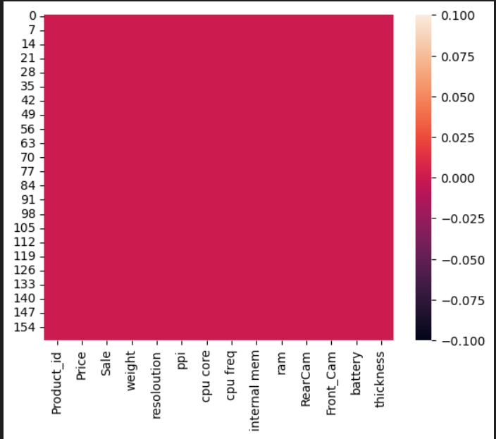
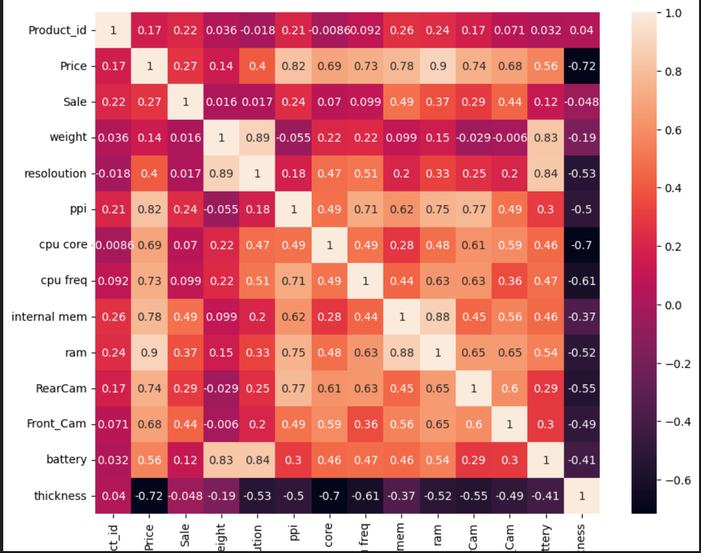
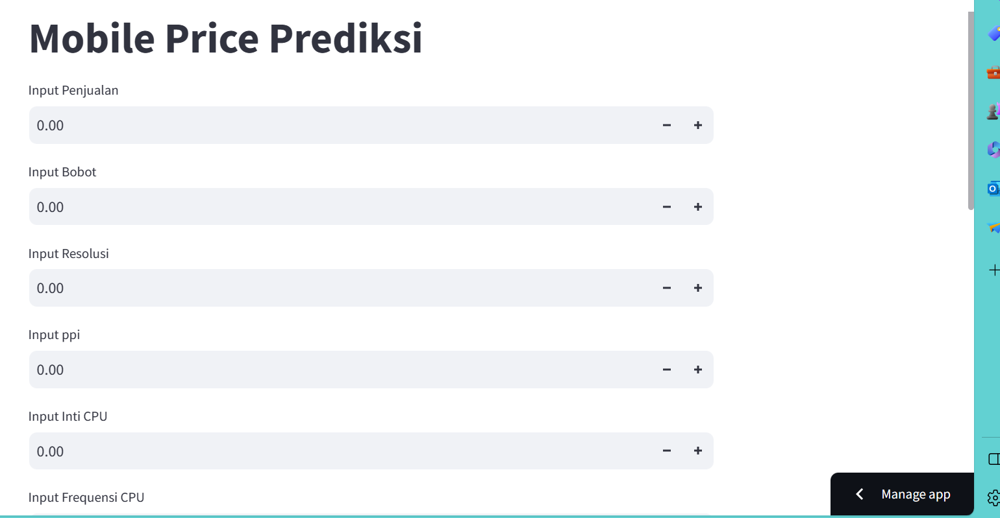

# Laporan Proyek Machine Learning

### Nama : Aditya Budiansyah

### Nim : 211351004

### Kelas : Pagi B

## Domain Proyek

Data mengenai prediksi harga ponsel ini digunakan sebagai bantuan atau pacuan dari harga ponsel apabila dilihat dari beberapa data atau aspek seperti merk,ukuran, berat, kualitas gambar,RAM, baterai maupun daya CPU

## Business Understanding

Perkiraan ini dapat membantu untuk memperkirakan harga ponsel apabila hanya mengetahui speknya saja

Bagian laporan ini mencakup:

### Problem Statements

Menjelaskan pernyataan masalah latar belakang:

- Kurangnya meluasnya sebaran informasi mengenai harga ponsel yang tersedia sehingga agak kesulitan untuk mengetahui harga ponsel

### Goals

Menjelaskan tujuan dari pernyataan masalah:

- Sebagai upaya untuk memprediksi harga ponsel berdasarkan speknya untuk ponsel yang sudah diluncurkan maupun belum diluncurkan

Semua poin di atas harus diuraikan dengan jelas. Anda bebas menuliskan berapa pernyataan masalah dan juga goals yang diinginkan.

### Solution statements

- Pengembangan platform dari prediksi lemak dalam tubuh yang berbasis web adalah menggembangkan plagform yang berisi cara memperkirakan harga dari sebuah ponsel apabila hanya diketahui beberapa speknya saja, sehingga kita bisa mempekirakannya terlebih dahulu bahkan mungkin sebelum ponsel tersebut diluncurkan
- Model yang dihasillkan dari datasets ini menggunakan metode Linear Regression.

## Data Understanding

Harga ponsel bergantung pada berbagai faktor seperti resolusi, merek, ukuran, berat, kualitas gambar, RAM, baterai, dan daya cpu. Pada dataset ini, kami ingin memperkirakan harga ponsel menggunakan fitur-fitur di atas.

[Mobile Price Predictionn](https://www.kaggle.com/datasets/mohannapd/mobile-price-prediction).

Selanjutnya menguraikan seluruh variabel atau fitur pada data

### Variabel-variabel pada Global Video Game Sales adalah sebagai berikut:

- Product_id : menunjukkan Product_id (int64)
- Price : menunjukkan harga (int64)
- Sale : menunjukkan penjualan (int64)
- weight : menunjukkan bobot (float64)
- resoloution: menunjukkan resolusi (float64)
- ppi : menunjukkan ppi (int64)
- cpu core : menunjukkan inti cpu (int64)
- cpu freq : menunjukkan frekuensi cpu (float64)
- internal mem : menunjukkan mem internal (float64)
- ram : menunjukkan ram (float64)
- RearCam : menunjukkan Kamera Belakang (float64)
- Front Cam : Menunjukkan Kamera Depan (float64)
- battery : menunjukkan baterai (int64)
- thickness : menunjukkan ketebalan (float64)

## Data Preparation

### Data Collection

Untuk data collection ini, saya mendapatkan dataset yang nantinya digunakan dari website kaggle dengan nama dataset Mobile Price Prediction

### Data Discovery And Profiling

Untuk bagian ini, kita akan menggunakan teknik EDA. <br>
Pertama kita mengimport semua library yang dibutuhkan,

```bash
import pandas as pd
import numpy as np
import matplotlib.pypot as plt
import seaborn as sns
```

Karena kita menggunakan google colab untuk mengerjakannya maka kita akan import files juga,

```bash
from google.colab import files
```

Lalu mengupload token kaggle agar nanti bisa mendownload sebuah dataset dari kaggle melalui google colab

```bash
file.upload()
```

Setelah mengupload filenya, maka kita akan lanjut dengan membuat sebuah folder untuk menyimpan file kaggle.json yang sudah diupload tadi

```bash
!mkdir -p ~/.kaggle
!cp kaggle.json ~/.kaggle/
!chmod 600 ~/.kaggle/kaggle.json
!ls ~/.kaggle
```

lalu mari kita download datasetsnya

```bash
!kaggle datasets download -d azadshahvaladov//mobile-price-prediction
```

Selanjutnya kita harus extract file yang tadi telah didownload

```bash
!mkdir /mobile-price-prediction
!unzip /mobile-price-prediction.zip -d /mobile-price-prediction
!ls /mobile-price-prediction
```

Mari lanjut dengan memasukkan file csv yang telah diextract pada sebuah variable, dan melihat 5 data paling atas dari datasetsnya

```bash
df = pd.read_csv('mobile-price-prediction/Cellphone.cs')
df.head()
```

Untuk melihat mengenai type data dari masing masing kolom kita bisa menggunakan property info,

```bash
df.info()
```

kita rubah dulu nama kolomnya terlebih dahulu

```bash
df.rename(columns={'cpu core': 'cpu_core', 'cpu freq': 'cpu_freq', 'internal mem': 'internal_mem'}, inplace=True)
print("\nDataFrame setelah mengubah nama kolom")
print(df)
```

Selanjutnya kita akan memeriksa apakah datasetsnya terdapat baris yang kosong atau null dengan menggunakan seaborn,

```bash
sns.heatmap(df.isnull())
```

 <br>

Mari kita lanjut dengan data exploration kita,

```bash
plt.figure(figsize=(10,8))
sns.heatmap(df.corr(), annot=True)
```



## Modeling

sebelumnya mari kita import library yang nanti akan digunakan,

```bash
from sklearn.model_selection import train_test_split
from sklearn.linear_model import LinearRegression
```

Langkah pertama adalah memasukkan kolom-kolom fitur yang ada di datasets dan juga kolom targetnya,

```bash
features = ['weight','resoloution','ppi','cpu_core','cpu_freq','internal_mem','ram','RearCam','Front_Cam','battery','thickness']
x = df[features]
y = df['Price']
x.shape, y.shape
```

Selanjutnya kita akan menentukan berapa persen dari datasets yang akan digunakan untuk test dan untuk train

```bash
x_train, X_test, y_train, y_test = train_test_split(x,y,random_state=70)
y_test.shape
```

lalu membuat mode dan memasukkan X_train dan y_train pada model dan memasukkan value predict pada y_pred,

```bash
lr = LinearRegression()
lr.fit(x_train,y_train)
pred = lr.predict(X_test)
```

sekarang kita bisa melihat score dari model kita,

```bash
score = lr.score(X_test, y_test)
print('akurasi model regresi linier = ', score)
```

Bagus juga, 0.9367779464202626, mari kita test menggunakan sebuah array value

```bash
input_data = np.array([[135,5.2,424,8,1.35,16,3,13,8,2610,7.4]])

prediction = lr.predict(input_data)
print('Estimasi Price Mobile :', prediction)
```

berhasil!!, sekarang modelnya sudah selesai, mari kita export sebagai sav agar nanti bisa kita gunakan pada project web streamlit kita.

```bash
import pickle

filename = 'estimasi_Mobile_Price_rediction.sav'
pickle.dump(lr,open(filename,'wb'))
```

## Evaluation

Disini saya menggunakan R2 score sebagai metrik evaluasi.

R-squared atau R2 pada dasarnya digunakan untuk melihat bagaimana penambahan variabel independen membantu menjelaskan varians variabel dependen. Secara umum R2 dapat memberikan ukuran seberapa baik model dalam menjelaskan variabel dependen (variabel yang dipengaruhi) atau goodness of fit.

R2 secara definisi merupakan rasio dari varians yang dijelaskan oleh variabel independen (penjelas) dibandingkan varians tanpa adanya variabel independen, berikut rumus dari R2.

R2 = SSE/SST = 1 - SSR/SST

Setelah itu saya menerapkannya dalam kode menggunakan fungsi r2_score, seperti berikut :

```bash
from sklearn.metrics import r2_score

r2 = r2_score(y_test, pred)
print('r2 score for perfect model is', r2)
```

dan hasil yang saya dapatkan adalah 0.9367779464202626, itu berarti model ini memiliki keseimbangan yang baik antara presisi dan recall.

## Deployment

[My Estimation App](https://appmobileprice-aditya.streamlit.app/).



##
